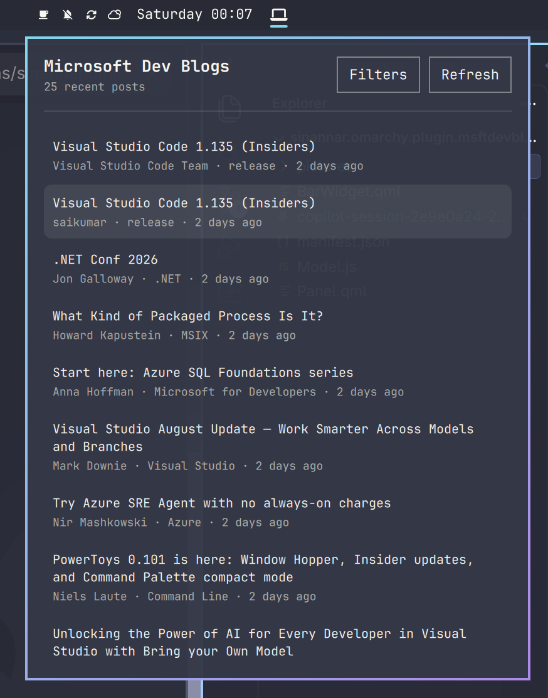
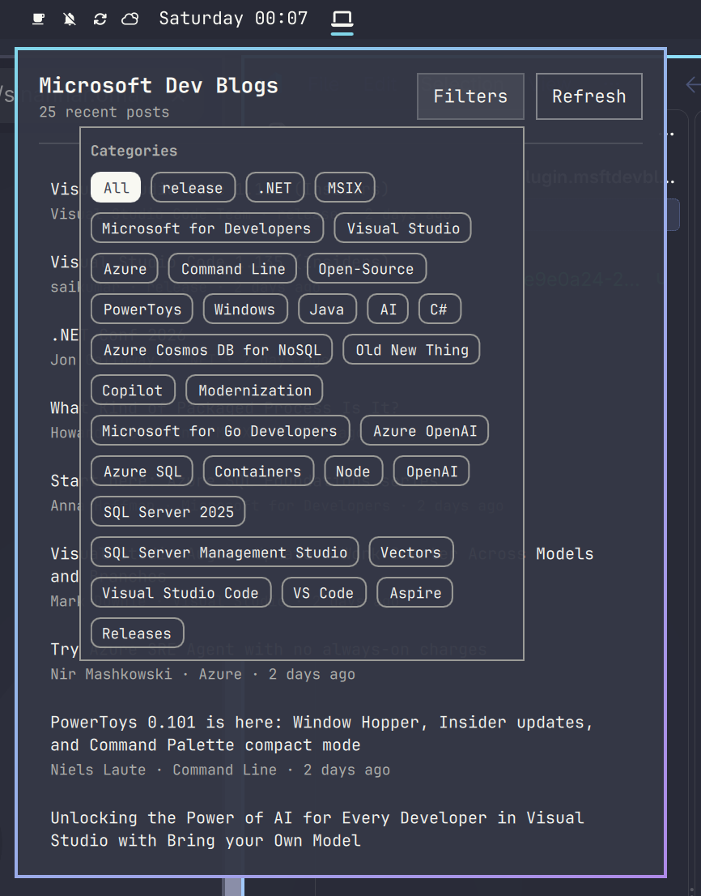

# Microsoft Dev Blogs

A compact Omarchy bar widget and details panel for recent posts from the
[Microsoft for Developers](https://devblogs.microsoft.com/landing/) RSS feed.
The bar shows a developer-machine glyph; the panel lets you browse recent
posts, filter them by category, refresh the feed, and open a post in your
default browser.

## Screenshots

The default widget and panel show the latest posts with title, author,
category, and publication time. The image contains only public article
metadata and no personal account information.



The Filters control opens a category picker. Selected categories restrict the
visible list; choosing **All** clears the filter. The image shows public feed
category names only.



## Install

```sh
omarchy plugin add https://github.com/sinannar/sinannar.omarchy.plugin.msftdevblogs.git --enable
```

## Usage

- **Click** the bar widget to open or close the details panel.
- **Middle-click** it to refresh the feed immediately.
- In the panel, select **Filters** to pin one or more categories. Select
  **All** to show every retained post.
- Select **Refresh** to fetch the feed again, or select a post to open its
  canonical HTTP(S) link in your default browser.

## Configure

Move the widget to a different bar section:

```sh
omarchy bar move sinannar.omarchy.plugin.msftdevblogs --section center
```

Settings are stored in the widget's inline entry in
`~/.config/omarchy/shell.json`. Set values with `omarchy bar set`; numeric
values require `--json`.

| Key | Default | Behavior |
|---|---:|---|
| `pollIntervalSec` | `900` | Feed polling interval in seconds. Values below `60` are clamped to `60`. |
| `pinnedCategories` | `[]` | Persisted category filters managed by the panel. An empty list shows all retained posts. |

For example, poll every 15 minutes:

```sh
omarchy bar set sinannar.omarchy.plugin.msftdevblogs pollIntervalSec 900 --json
```

## IPC

Use the following commands to control the widget from scripts:

```sh
omarchy-shell sinannar.omarchy.plugin.msftdevblogs refresh  # fetch now
omarchy-shell sinannar.omarchy.plugin.msftdevblogs open     # open panel
omarchy-shell sinannar.omarchy.plugin.msftdevblogs close    # close panel
omarchy-shell sinannar.omarchy.plugin.msftdevblogs show     # alias for open
omarchy-shell sinannar.omarchy.plugin.msftdevblogs hide     # alias for close
omarchy-shell sinannar.omarchy.plugin.msftdevblogs toggle   # toggle panel
```

## Dependencies

| Requirement | Why | Install |
|---|---|---|
| `curl` on `PATH` | Downloads the RSS feed. | Install your distribution's `curl` package. |

## Functional scope

- Fetches only `https://devblogs.microsoft.com/landing/`; it has no account,
  sign-in, telemetry, read-state, or article-content storage feature.
- Parses the feed into newest-first post metadata and retains the current
  successfully parsed snapshot. The panel displays at most 10 matching posts.
- Shows a post title, author, first category, and date; category filters can
  match any category attached to that post.
- Opens only canonical `http` or `https` post links. Links using other schemes
  are not opened.

## Safety and trust boundaries

This is a read-only feed viewer, but its network input is treated as
untrusted:

- Retrieval uses `curl -fsSL --max-time 10`, so failed HTTP responses are
  errors and a request has a 10-second limit.
- Feed output is collected as a stream with a hard 1 MiB cap. At most 200 RSS
  items are scanned, at most 10 posts are rendered, and no more than 20
  persisted category pins are honored.
- Feed-provided text is rendered with `Text.PlainText`; it is not interpreted
  as rich text or QML.
- Only HTTP(S) URLs pass the link check before `Qt.openUrlExternally` is
  called.
- A malformed, empty, truncated, or failed response keeps the last known-good
  post snapshot rather than replacing it with an empty panel.

## Troubleshooting

- **The widget says the feed is unavailable** — confirm `curl` is installed
  and `curl -fsSL --max-time 10 https://devblogs.microsoft.com/landing/`
  succeeds from a terminal. Click the widget or use the `refresh` IPC action
  to retry.
- **No posts appear yet** — the initial fetch may still be running, or the
  most recent fetch failed. Open the panel and select **Refresh**.
- **A category has no visible posts** — it may not occur among retained posts,
  or no retained post matches the pinned categories. Open **Filters** and
  select **All** to clear pins.
- **A post does not open** — the feed item may not provide a valid HTTP(S)
  canonical link. Non-HTTP(S) schemes are deliberately blocked.
- **Changes to `pollIntervalSec` seem ignored** — use `--json` for a number;
  values below 60 seconds intentionally run at the 60-second minimum.

## Remove

```sh
omarchy plugin remove sinannar.omarchy.plugin.msftdevblogs
```

## Files

| File | Responsibility |
|---|---|
| `manifest.json` | Plugin metadata and bar-widget entry point |
| `BarWidget.qml` | RSS retrieval, polling, retained snapshot, bar interaction, and IPC |
| `Panel.qml` | Post list, category filters, refresh control, and safe external link opening |
| `Model.js` | Bounded RSS parsing, normalization, filtering, and URL validation |
| `preview.png` | Conventional plugin preview, copied from the default widget screenshot |
| `pictures/devblogs.png` | Default widget and panel screenshot |
| `pictures/filters.png` | Category filter picker screenshot |
